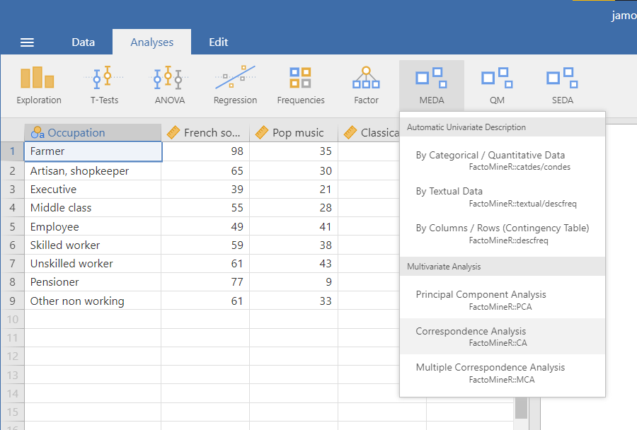
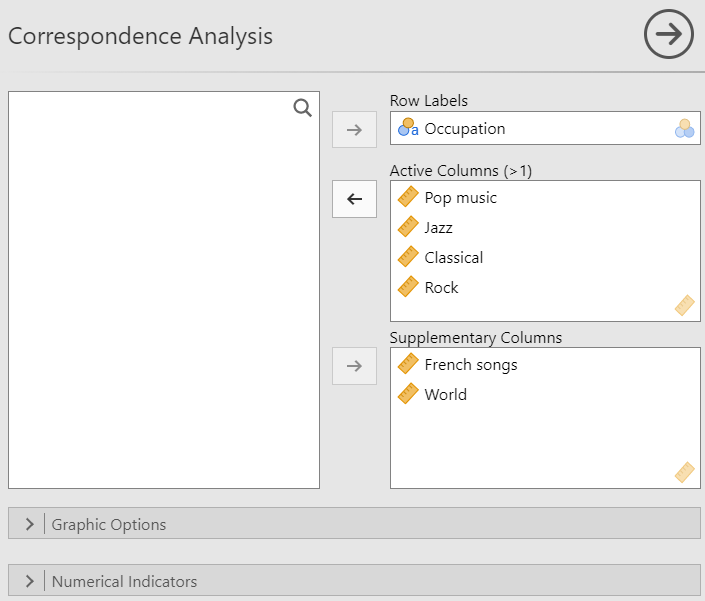
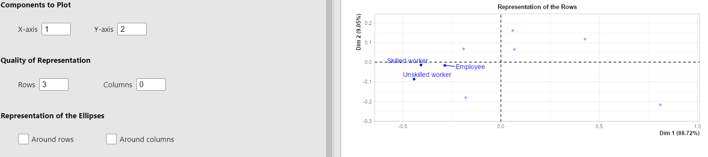

The second analysis available in the multivariate analysis submenu is the correspondence analysis.\
Since the CA is used on contingency table, the data you will be using in jamovi must contain a column with the row labels and the rest of the columns must only take as value positive integer (e.g. frequency in a contingency table). You can see an example in the figure below.
```{r CA1, out.width="80%", fig.align="left", echo=FALSE}

```
<br><br />


# **The interface**

The CA interface in it's a structure is very similar to the PCA interface. From top to bottom, there are the variable suppliers, the graphic options and the numerical indicators.
<br><br />

### Variables selection

```{r CA2, out.width="80%", fig.align="left", echo=FALSE}

```

Similarly to the PCA, the first part of the interface is selecting the variables and giving them a role. For the CA, you have to specify the variable used as the row labels as well as the active columns. it's also possible to add supplementary columns.
<br><br />

### Graphic options

```{r CA3, out.width="80%", fig.align="left", echo=FALSE}

```
<br><br />

The __*Components to Plot*__ options are used to select the dimensions to be plotted on the x-axis and y-axis. The __*Quality of Representation*__ options allow you to choose which rows (or columns) to highlight in the plot representing the rows (or columns). For instance, if we set 3 in the *Rows* text box, the 3 rows which are the best represented on both the x-axis and y-axis (the criteria used is the sum of the cosine on both of those axes), will be highlighted (see the figure below).

```{r CA4, out.width="100%", fig.align="left", echo=FALSE}

```

Lastly, the *Representation of the Ellipses* options allow you to display confidence ellipses around either or both rows and columns. 

```{r CA5, out.width="100%", fig.align="left", echo=FALSE}

```