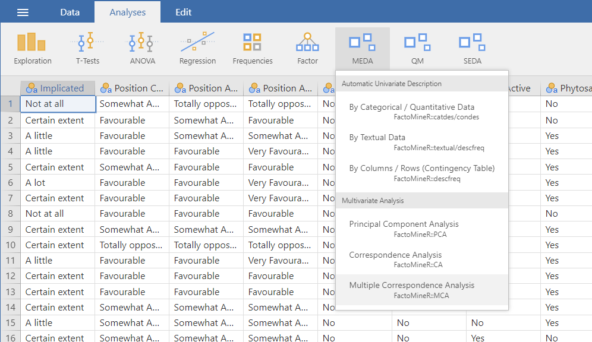

The third and last method of the **Multivariate Analysis** submenu is the multiple correspondence analysis. This analysis can take both nominal and ordinal categorical variables. The data used here is the gmo data set provided with the MEDA module.
```{r MCA1, out.width="80%", fig.align="left", echo=FALSE}

```
<br><br />

## **The interface**

The overall structure of the MCA GUI is the same as the other two **Multivariate Analysis** analysis.

### Variables selection
```{r MCA2, out.width="80%", fig.align="left", echo=FALSE}
knitr::include_graphics("images/MCA2.png")
```
<br><br />

The selection of the variables in the MCA is the same as the PCA which means that you have the individual labels, the active variables (which are qualitative unlike in the PCA where they are quantitative), and the quantitative and qualitative supplementary variables.

### The ventilation level
```{r MCA3, out.width="80%", fig.align="left", echo=FALSE}
knitr::include_graphics("images/MCA3.png")
```

The *Ventilation level* option let you fix the proportion under which a category will be ventilated. In other terms, it let you choose the proportion under which a category will be randomly assigned to another category.