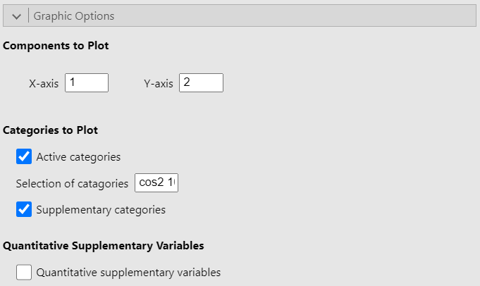
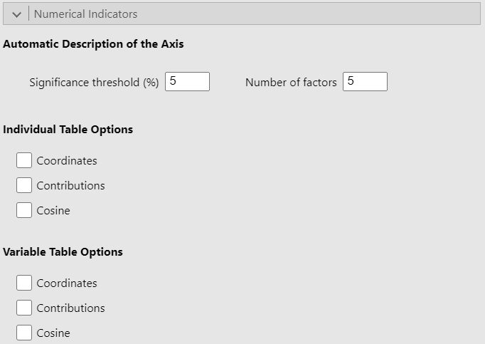
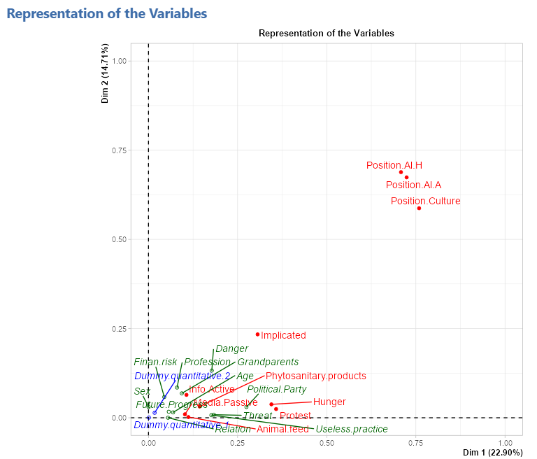
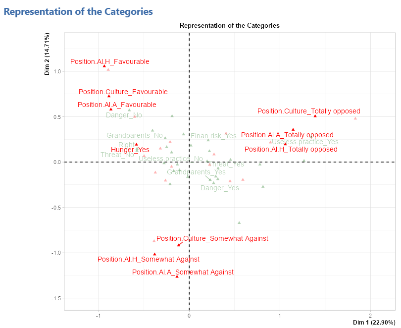
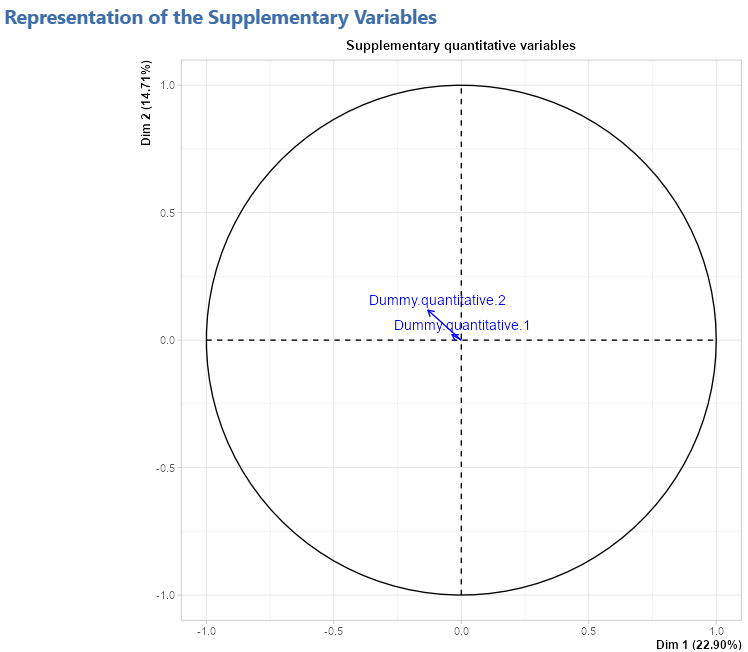
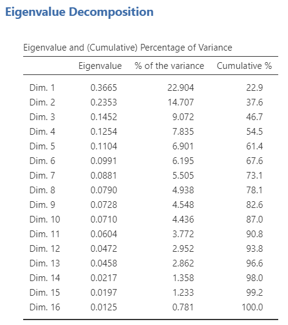
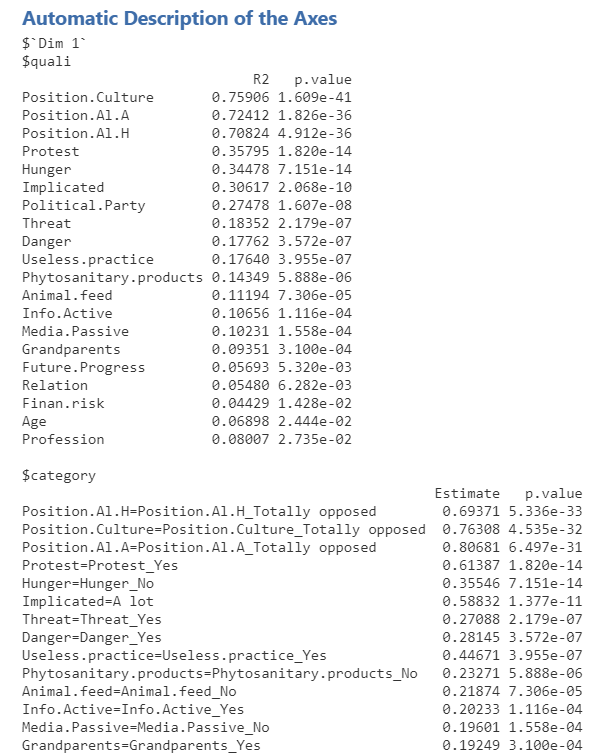
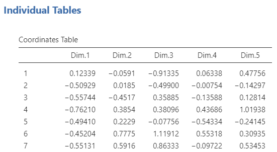

The third and last method of the **Multivariate Analysis** submenu is the multiple correspondence analysis. This analysis can take both nominal and ordinal categorical variables. The data used here is the gmo data set provided with the MEDA module.
```{r MCA1, out.width="60%", fig.align="left", echo=FALSE}
knitr::include_graphics("images/MCA1.png")
```
<br><br />

## **The interface**

The overall structure of the MCA GUI is the same as the other two **Multivariate Analysis** methods in MEDA.

### Variables selection
```{r MCA2, out.width="60%", fig.align="left", echo=FALSE}

```

The selection of the variables in the MCA is the same as the PCA which means that you have the individual labels, the active variables and the supplementary variables. The only difference is that the active variables in the MCA are categorical and not quantitative like in the PCA.
<br><br />

### The ventilation level
```{r MCA3, out.width="60%", fig.align="left", echo=FALSE}

```

The __*Ventilation level*__ option let you fix the proportion under which a category will be ventilated. In other terms, it let you choose the proportion under which a category will be randomly assigned to another category. (This option prevent the strong impact that rare categories often have.)
<br><br />

### Graphic options
```{r MCA4, out.width="60%", fig.align="left", echo=FALSE}

```

The __Graphic options__ allow you to choose which dimensions to plot as well as to whether to plot the either or both active and supplementary categories as well as to plot the correlation circle for the quantitative supplementary variables. Finally, the option __*Selection of categories*__ highlight a set number of categories based on a criterion. In the figure above, the option is set to "cos2 10" so that the 10 categories with the largest sum of square cosine on the plotted dimensions will be highlighted on the graph. However, the square cosine is not the only criterion you can use. The other criteria are:

* "coord x": highlight the x categories with the largest sums of the square coordinates on the 2 dimensions

* "contrib x": highlight the x categories with the biggest contributions

* "dist x": highlight the x categories with the highest distances to the center of gravity

<br><br />

### Numerical indicators
```{r MCA5, out.width="60%", fig.align="left", echo=FALSE}

```

Since this part of the interface is identical in the PCA and CA option and given that it has already been covered in the [PCA guide](PCA.html#numerical-indicators), we recommend that you read the explanation there.
<br><br />

## **Potential issue**

### Incorrect number of factors

The number of factors option must be less than or equal to the number of active variables selected. Otherwise, the analysis will produce an error.
<br><br />

## **Output example**

For this example, we use the gmo data set and we check all the option and let the default value for the other option. We put the 10 first variable in the *Active Variables (>1)* field and set the rest as categorical supplementary variable. Since the gmo data set doesn't have any quantitative variable, we simulated two and added them as supplementary quantitative variables.

### Representation of the individuals
```{r MCA6, out.width="60%", fig.align="left", echo=FALSE}

```
<br><br />

### Representation of the variables
```{r MCA7, out.width="60%", fig.align="left", echo=FALSE}

```
<br><br />

### Representation of the categories
```{r MCA8, out.width="60%", fig.align="left", echo=FALSE}

```
<br><br />

### Representation of the quantitative supplementary variables
```{r MCA9, out.width="60%", fig.align="left", echo=FALSE}

```
<br><br />

### Eigenvalue table
```{r MCA10, out.width="40%", fig.align="left", echo=FALSE}

```
<br><br />

### Description of the axes
```{r MCA11, out.width="40%", fig.align="left", echo=FALSE}

```
<br><br />

### Individual tables (coordinates)
```{r MCA12, out.width="40%", fig.align="left", echo=FALSE}

```
<br><br />

### Variable tables (coordinates, contribution, cosine)
```{r MCA13, out.width="60%", fig.align="left", echo=FALSE}
knitr::include_graphics(c("images/MCA13.png","images/MCA14.png","images/MCA15.png"))
```
<br><br />