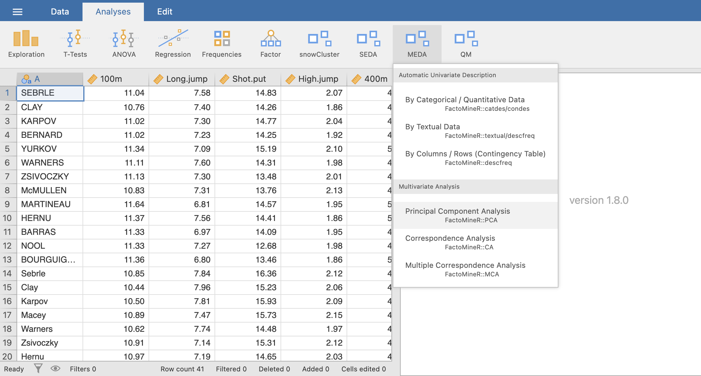
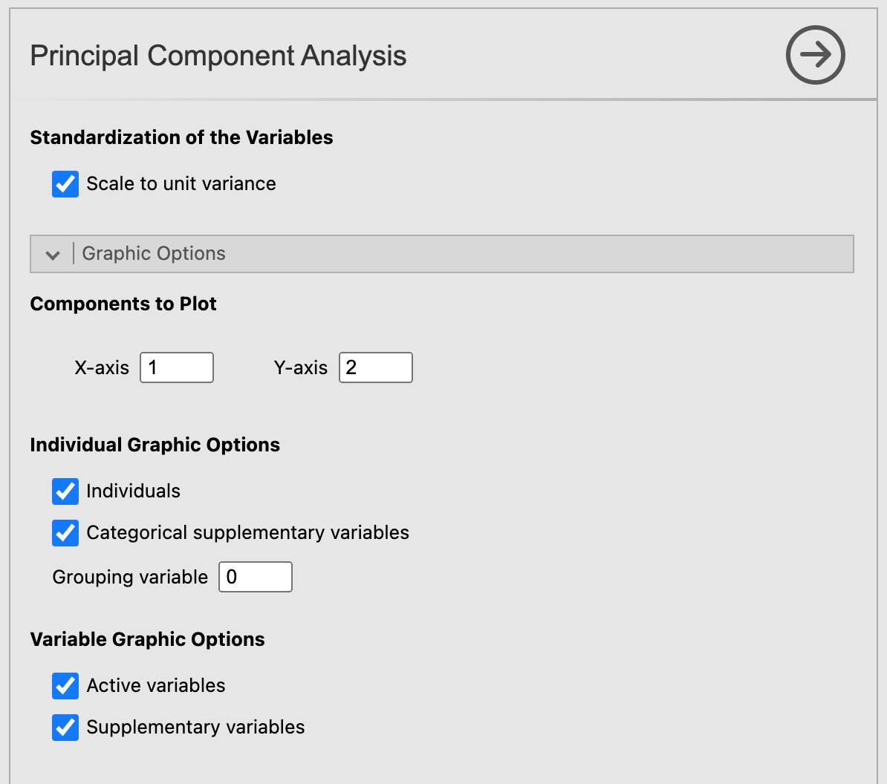

Let's click on the Principal Component Analysis button.\
For the demonstration of the PCA module, we will be using the decathlon data set (you can catch a glimpse of it on the figure below) which is bundled with MEDA.

```{r PCA1, out.width="80%", fig.align="left", echo=FALSE}

```
<br><br />

# **The interface**

When opening the PCA submodule, a rather long graphic user interface (a.k.a. GUI) appears.  It might feels intimidating at first, but we will see how it works step by step.
<br><br />

### Variables selection

The first part of this GUI, like most of jamovi modules, is about selecting the variables for your analysis and giving them a role. As you can see on the figure below, there are 4 different type of variable for the PCA. First, we have the active variables, which in the case of a PCA are imperatively quantitative. For the PCA to run correctly, you must select a number of active variables greater than or equal to the number of factors given in the __*Automatic Description of the Axes*__ part of the GUI (see the third figure below). If this condition is not met, the analysis will produce an error. Then comes the french touch of this module: the quantitative and categorical supplementary variables. These variables won't participate in the construction of the different axes but will be plotted on the individuals factor map (for the categories of the categorical variables) and on the variables factor map (for the quantitative supplementary variables). Lastly, the individual variables will assign a label to each individuals on the individuals factor map.
<br><br />
```{r PCA2, out.width="50%", fig.align="left", echo=FALSE}
knitr::include_graphics("images/PCA2.png")
```
<br><br />

### Normalized PCA
Now, if we scroll down the GUI, we see an option called __*Scale to unit variance*__. This option purpose is to normalize the quantitative variables used in the PCA. Since most of the time PCA are performed on normalized data, this option is checked by default.
<br><br />

### Graphic options
Let's move on to the next set of options: the **graphic options**. As the name suggests, those options rules the display of the graphics in the results window. With those options, you can choose which components to plot on x-axis and the y-axis. For the individuals factor map, you can choose to display only the individuals, only the categories (of the categorical variables) or both of them. It's also possible to color the individuals based on the value they have for the categorical variable with the option _**Grouping variable**_. You can do the same with the active and supplementary variables for the variables factor map.
<br><br />
```{r PCA3, out.width="50%", fig.align="left", echo=FALSE}

```
<br><br />

### Numerical indicators
At last, we have the options for the numerical indicators. The options *Significance threshold* from the __*Automatic Description of the Axes*__ section fixes the threshold beneath which a variable characterize a dimension. The option __*Number of factors*__ affect on both the number of dimensions to be described and the number of dimensions shown for the individual and variable tables (which will be covered right after).\
Finally, the individual and variable tables give you the freedom to choose to show or not some indicators calculated during the PCA: the coordinates, the contributions and the cosine of each individual/variable.

```{r PCA4, out.width="50%", fig.align="left", echo=FALSE}
knitr::include_graphics("images/PCA4.png")
```
<br><br />

## **Example**
