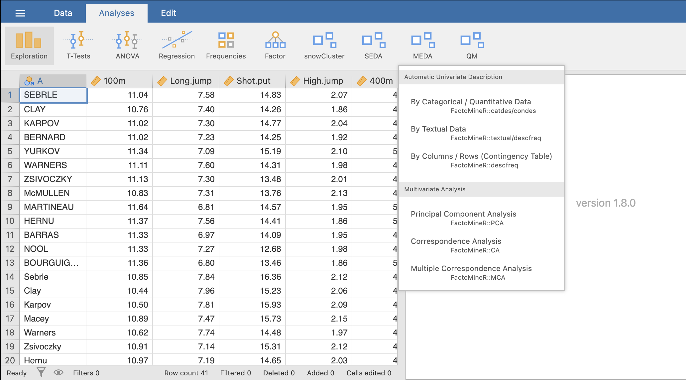

The first method of the **Automatic Univariate Description** submenu is the description of either continuous or categorical variable by both continuous and categorical variables.
```{r catdes1, out.width="80%", fig.align="left", echo=FALSE}

```